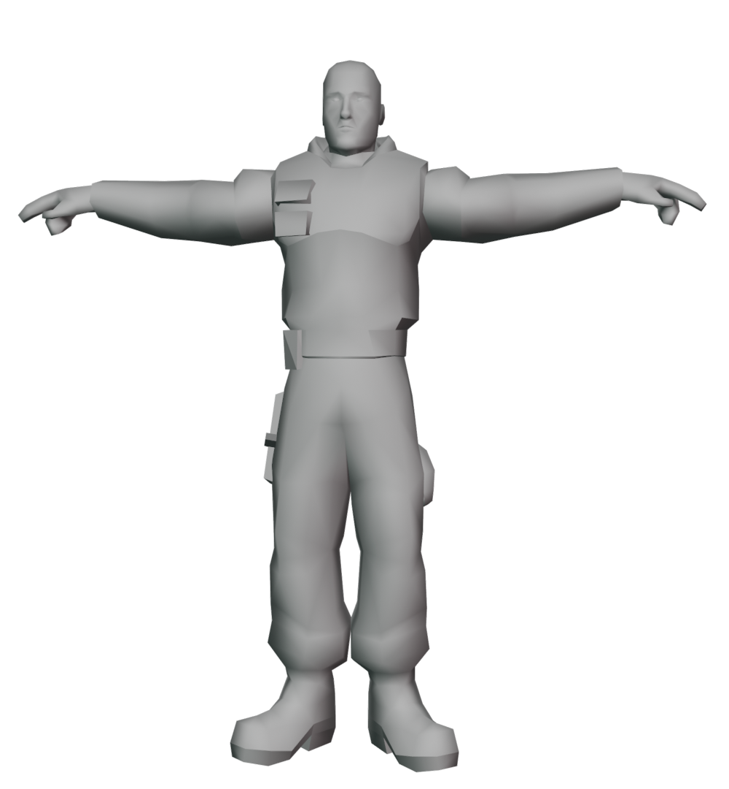

<h1 align="center"> 
Cold Winter - 3D Model Viewer (WIP)
</h1>

  

<h4 align="center"> 
Noesis plugin for visualizing models from Cold Winter (PS2)
</h4>

## Description
This project is a plugin developed for the Noesis tool, specifically designed to allow the visualization and extraction of 3D models (without textures for now) from the video game Cold Winter.

## Features
- Support for visualizing character meshes and some objects.

## Installation
1. Download the plugin script (`fmt_ColdWinter_DFF.py`).
2. Navigate to the Noesis installation folder.
3. Copy the file into the `plugins/python` directory.
4. Restart Noesis (if it was already open) for the changes to take effect.